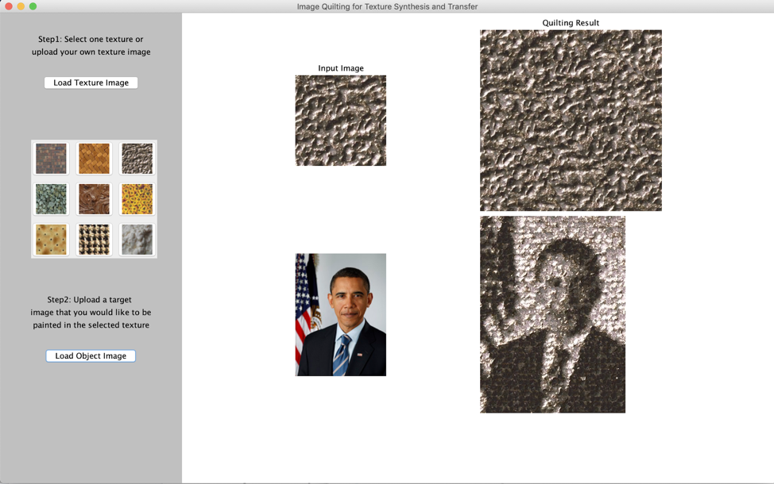
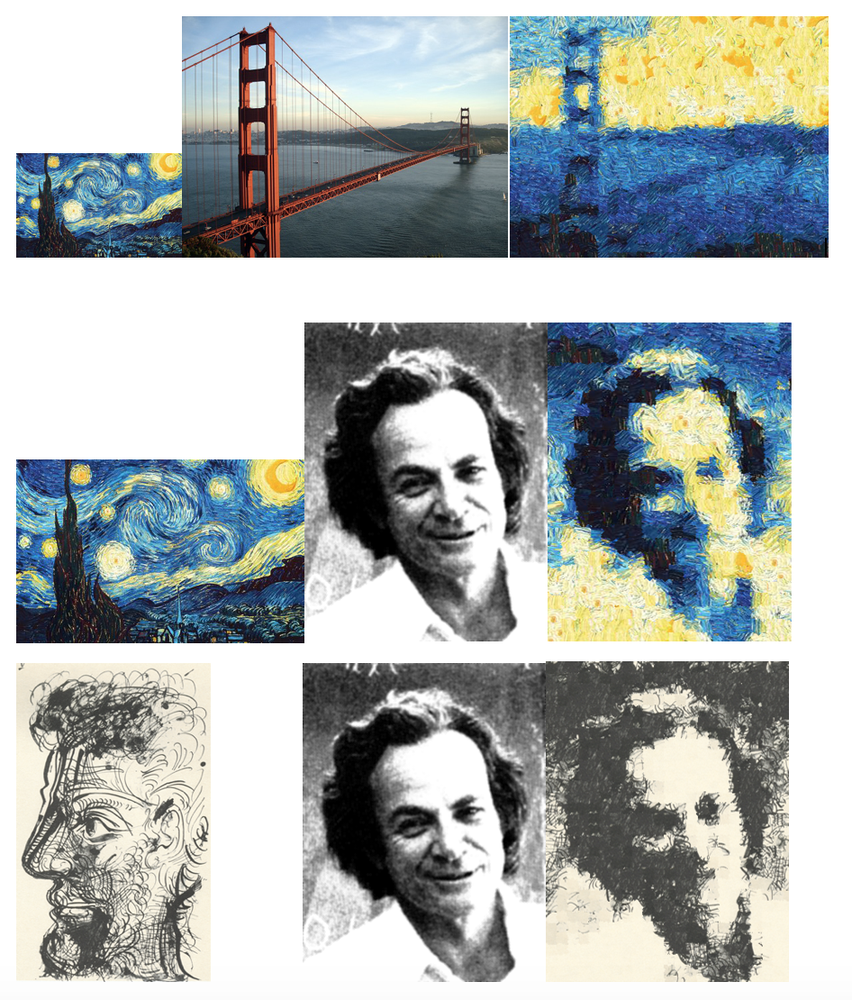
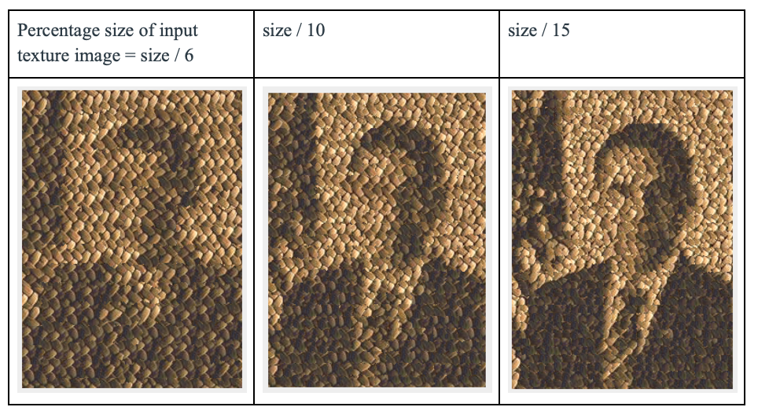

# Image Quilting and Texture Transfer

#####  Based on Image Quilting for Texture Synthesis and Transfer by Alexei A. Efros and William T. Freeman

Image quilting is an image-based method of generating novel visual appearance in which a new image is synthesized by stitching together small patches of existing images, while texture transfer means re-rendering an image in the style of another one by taking the texture from a different object. The authors present a simple image-based method of generating novel visual appearance in which a new image is synthesized by stitching together small patches of existing images. More generally, they demonstrate how an image can be re-rendered in the style of a different image. The goal of the project is to use image quilting as a simple algorithm to synthesize textures from small patches of existing images and then use the texture to re-rendering a new image with the style of the previous one. Our approach to the problem is implementing the image quilting method and the texture transfer technique by Efros and Freeman. We will generate a user-friendly interactive system. However, this only works for most images as there are still many images that appear to be clearly segmented after image quilting. 

